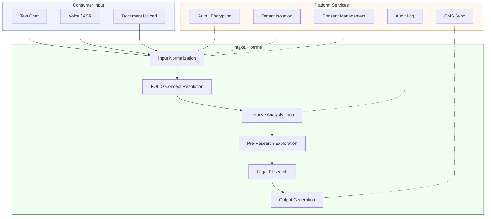
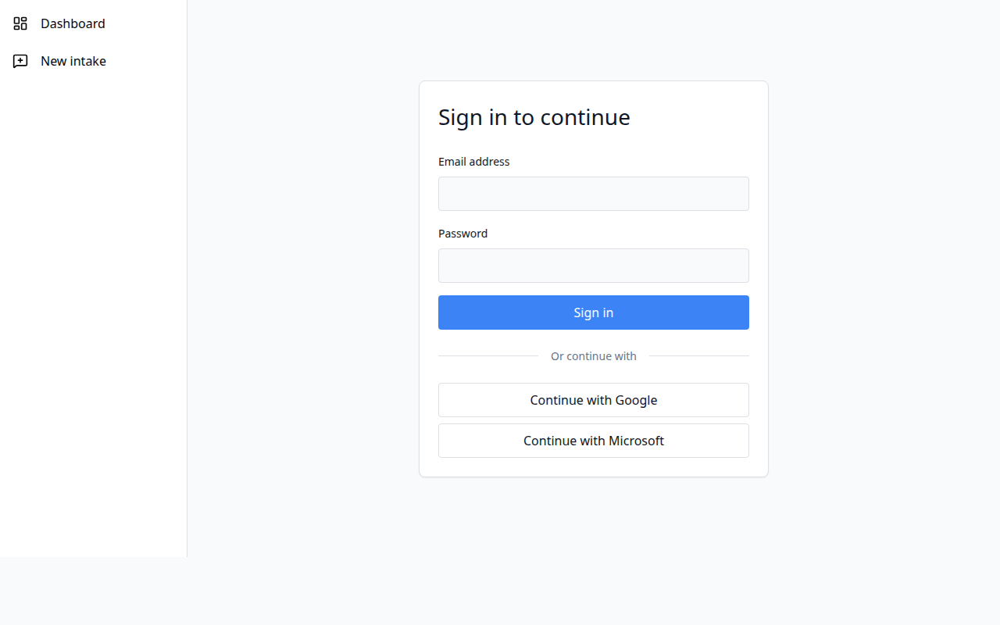
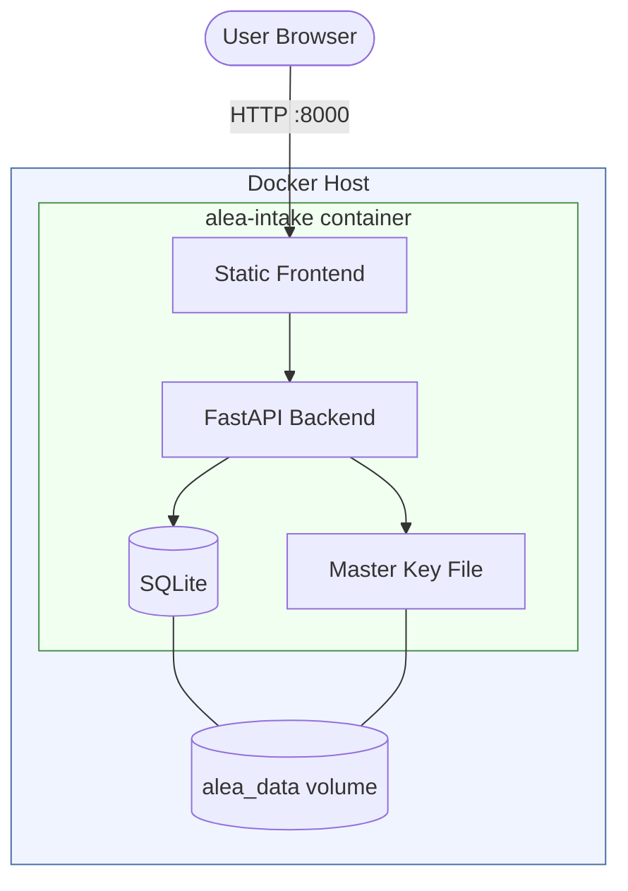
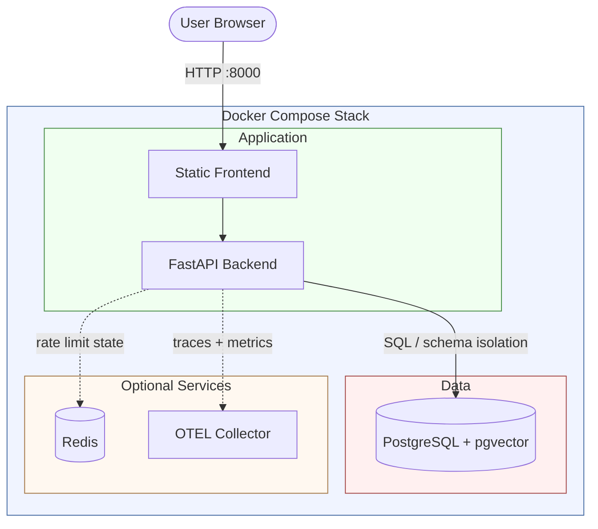
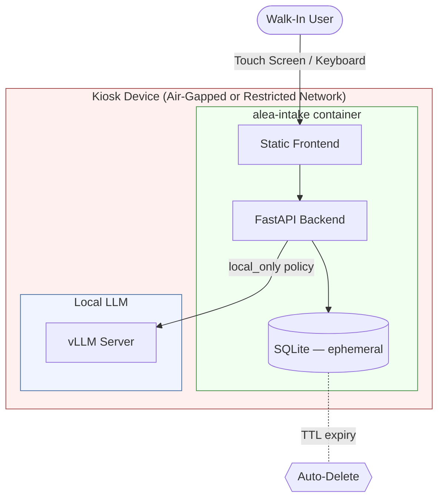
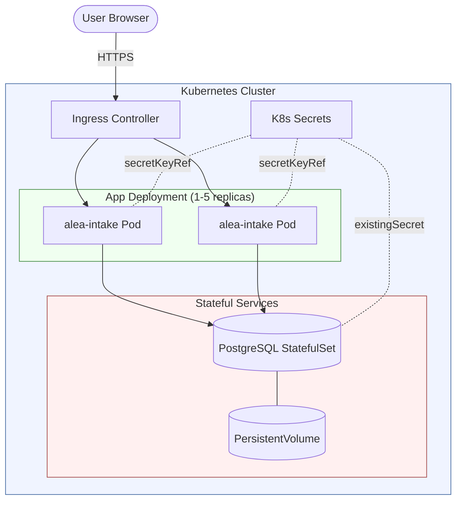

# ALEA Intake

**Open-source, privacy-first legal intake for access to justice.**

[](LICENSE)
[](https://www.python.org/)
[](https://react.dev/)
[](https://www.typescriptlang.org/)

ALEA Intake is an open-source legal intake platform that helps people describe their legal situations and then identifies the legal issues involved -- including ones the person may not know to mention. It produces a structured analysis mapping the person's facts to claims, legal elements, and authorities across applicable jurisdictions. The system is built for organizations that serve people who cannot afford lawyers: legal aid societies, court self-help centers, domestic violence shelters, public defenders, and similar programs.

ALEA Intake is developed by the [ALEA Institute](https://github.com/alea-institute), a research institute building open infrastructure to support justice and the public good -- for example, advancing access to justice through open technology.

> *Any legal service provider -- especially those serving low-income consumers -- can adapt this system.*

---

## Table of Contents

- [Architecture](#architecture)
- [Screenshots](#screenshots)
- [Use Cases](#use-cases)
  - [Core Use Cases](#core-use-cases)
    - [Legal Aid Intake](#legal-aid-intake)
    - [Court Self-Represented Litigant Portals](#court-self-represented-litigant-portals)
    - [Domestic Violence and Victim Services](#domestic-violence-and-victim-services)
    - [Tenant Rights and Eviction Defense](#tenant-rights-and-eviction-defense)
  - [Specialty Use Cases](#specialty-use-cases)
    - [Law School Clinics](#law-school-clinics)
    - [Public Defender Intake](#public-defender-intake)
    - [Immigration Services](#immigration-services)
    - [Bar Association Lawyer Referral](#bar-association-lawyer-referral)
    - [Veterans' Benefits Assistance](#veterans-benefits-assistance)
    - [Disability Benefits](#disability-benefits)
    - [Consumer Protection and Debt Defense](#consumer-protection-and-debt-defense)
    - [Family Law and Mediation Intake](#family-law-and-mediation-intake)
- [Key Capabilities](#key-capabilities)
  - [Multi-Language Support](#multi-language-support)
  - [Three Autonomy Modes](#three-autonomy-modes)
  - [Ephemeral Mode and Right-to-Delete](#ephemeral-mode-and-right-to-delete)
  - [FOLIO Ontology Grounding](#folio-ontology-grounding)
- [Quick Start](#quick-start)
- [Security](#security)
  - [Encryption](#encryption)
  - [Authentication and Authorization](#authentication-and-authorization)
  - [Audit Logging](#audit-logging)
  - [Consent Management](#consent-management)
  - [Right-to-Delete](#right-to-delete)
  - [LLM Data Privacy](#llm-data-privacy)
  - [Tenant Isolation](#tenant-isolation)
  - [Network Security](#network-security)
- [Deployment Topologies](#deployment-topologies)
  - [Single-Tenant Docker Compose (SQLite)](#single-tenant-docker-compose-sqlite)
  - [Multi-Tenant PostgreSQL](#multi-tenant-postgresql)
  - [Kiosk Deployment](#kiosk-deployment)
  - [Kubernetes with Helm](#kubernetes-with-helm)
- [Data Flow and Security Model](#data-flow-and-security-model)
- [Configuration Reference](#configuration-reference)
  - [Platform Settings (Environment Variables)](#platform-settings-environment-variables)
  - [Organization-Level Settings (Admin API)](#organization-level-settings-admin-api)
- [Scenario Walkthroughs](#scenario-walkthroughs)
  - [Legal Aid Kiosk](#legal-aid-kiosk)
  - [Court SRL Portal](#court-srl-portal)
  - [Multi-Tenant Cloud](#multi-tenant-cloud)
  - [Small Legal Aid Office](#small-legal-aid-office)
  - [Domestic Violence Shelter](#domestic-violence-shelter)
- [Roadmap](#roadmap)
- [License](#license)
- [Contributing](#contributing)

---

## Architecture

ALEA Intake processes legal intake through a multi-stage pipeline. A person provides input -- text typed in a chat interface, voice recorded and transcribed, or uploaded documents -- and the system normalizes that input, resolves legal concepts against the [FOLIO open legal ontology](https://github.com/FOLIO-Org), runs an iterative analysis loop to identify claims and missing elements, conducts legal research to find supporting authorities, and generates structured output for the attorney or program staff reviewing the case.

The pipeline is designed to be transparent at every stage. Each legal concept is mapped to a specific FOLIO ontology node, so an attorney reviewing the output can trace exactly why the system identified a particular issue. Facts extracted from the person's narrative are linked to the legal elements they support, and gaps -- elements that lack factual support -- are flagged for follow-up.



**Pipeline stages:**

| Stage | What it does |
|-------|-------------|
| **Input Normalization** | Accepts text, transcribed audio, or extracted document text. Normalizes into a consistent internal format. |
| **FOLIO Concept Resolution** | Maps the person's description to legal concepts in the FOLIO open legal ontology using embedding similarity and LLM verification. Unmapped concepts are flagged and preserved, not dropped. |
| **Iterative Analysis Loop** | Identifies potential claims, maps extracted facts to legal elements, scores completeness, and identifies gaps. Runs multiple passes to catch issues the person did not explicitly mention. |
| **Pre-Research Exploration** | Explores adjacent legal areas (via FOLIO ontology graph traversal) that may be relevant but were not directly stated. Includes a safety screening layer for domestic violence indicators. |
| **Legal Research** | Queries external sources (CourtListener, optional MCP-based tools) for case law, statutes, and regulations. Verifies citations, ranks results by relevance and jurisdiction, and identifies binding vs. persuasive authority. |
| **Output Generation** | Produces structured output: triage recommendations, claim-by-claim analysis, jurisdiction-specific authority lists, referral suggestions, and exportable formats (PDF, JSON, plain text). |

**Supporting services** run alongside the pipeline:

- **Auth and Encryption:** JWT access/refresh tokens, OAuth 2.0 SSO (Google, Microsoft), AES-256-GCM envelope encryption with per-tenant data encryption keys.
- **Audit Log:** Immutable, append-only event log recording every significant action.
- **Tenant Isolation:** Multi-tenant schema isolation (each organization gets its own database schema) or single-tenant deployment.
- **CMS Sync:** Optional two-way synchronization with case management systems (Clio, MyCase, LegalServer).
- **Consent Management:** Configurable per-organization consent flows with recorded consent records.

---

## Screenshots

### Login



The login page supports email/password authentication and OAuth 2.0 single sign-on with Google and Microsoft. The sidebar navigation is visible on all pages.

### Chat Interface

> Screenshot placeholder — see [`docs/images/chat.txt`](docs/images/chat.txt) for a description of what this view shows. A live screenshot will be added once the full backend is running.

The chat interface is the primary intake surface. It supports text, voice, and document-upload modalities, with real-time streaming responses and an analysis progress panel. A safety banner appears automatically during sessions flagged for domestic violence, providing hotline resources.

### Intake Dashboard

> Screenshot placeholder — see [`docs/images/dashboard.txt`](docs/images/dashboard.txt) for details. A live screenshot will be added once the full backend is running.

The dashboard lists all intake sessions with filtering, sortable columns, and toggle between table and card-grid views. A virtual list activates automatically when the intake count exceeds 100 records.

### Admin Configuration

> Screenshot placeholder — see [`docs/images/admin.txt`](docs/images/admin.txt) for details. A live screenshot will be added once the full backend is running.

The admin panel provides tabbed configuration for organization settings, LLM providers, autonomy modes, CMS integrations, security, and FOLIO ontology parameters. A guided setup wizard is available for initial deployment.

### Analysis Visualization

> Screenshot placeholder — see [`docs/images/visualization.txt`](docs/images/visualization.txt) for details. A live screenshot will be added once the full backend is running.

The visualization page renders the FOLIO-grounded legal analysis in three modes: a D3 force-directed graph of facts, claims, and elements; a coverage matrix with confidence-colored cells; and a structured narrative. All views use the Okabe-Ito colorblind-safe palette and support export to SVG, PNG, CSV, or PDF.

---

## Use Cases

The following use cases describe the organizations and scenarios where ALEA Intake fits. The four core use cases have the most detailed treatment. The eight specialty use cases are shorter but highlight which system capabilities are most relevant for each context.

### Core Use Cases

#### Legal Aid Intake

**Who deploys it:** LSC-funded legal aid organizations, non-LSC legal aid societies, pro bono programs at scale.

**Problem solved:** Legal aid programs are overwhelmed. Intake staff conduct brief phone or in-person interviews to determine eligibility and identify legal issues, but the volume of callers and the complexity of overlapping legal problems means that issues get missed. A tenant facing eviction may also have wage theft claims, public benefits denials, or consumer debt problems that only surface with deeper questioning. Traditional intake forms capture the issue the person called about but miss the rest.

ALEA Intake conducts a thorough conversational intake -- by chat, voice, or document review -- and uses the FOLIO legal ontology to identify all relevant legal issues, not just the one the person initially described. The iterative analysis loop specifically checks for related claims that commonly co-occur. The output is a structured analysis that intake staff can review, with each identified issue traced to specific facts and legal elements.

**Recommended configuration:**

| Setting | Value | Why |
|---------|-------|-----|
| Deployment mode | `multi_tenant` or `single_tenant` | Multi-tenant for statewide programs with multiple offices; single-tenant for a single office |
| Persistence mode | `persistent` or `ephemeral` | Persistent for ongoing case tracking; ephemeral for intake-only with auto-deletion |
| LLM data policy | `cloud_optout` or `local_only` | Cloud with opt-out for most programs; local-only (vLLM) for programs that prohibit any cloud data transmission |
| Multi-language | Enabled | Many legal aid clients speak languages other than English |
| Autonomy mode | `professional` | Staff reviews and approves each analysis stage before the system proceeds |

**Key safeguards:**

- **Consent flow:** Each person sees and accepts a consent disclosure before the intake begins. Consent records are stored and auditable.
- **Right-to-delete:** After intake, the person (or staff on their behalf) can request deletion. Three policies are available: full deletion, anonymization, or time-based auto-deletion.
- **Audit trail:** Every action is logged in an immutable, append-only audit log. For programs subject to funder reporting requirements, the audit log provides a record of what was done and when.
- **No LLM training:** API-tier access means cloud LLM providers do not use intake data for model training. Programs that need stronger guarantees can run a local LLM (vLLM) with the `local_only` data policy.

**Deployment scenario:** A statewide legal aid program deploys ALEA Intake as a multi-tenant cloud instance. Each regional office is a separate tenant with its own encryption keys and database schema. Intake staff use the professional autonomy mode -- the system conducts the interview and drafts an analysis, but staff review and approve each stage. Clients can complete intake in English, Spanish, or Vietnamese. Sessions are persistent, with a 90-day retention policy. The CMS connector syncs accepted cases to Clio for ongoing case management.

---

#### Court Self-Represented Litigant Portals

**Who deploys it:** State and local courts, court self-help centers, court navigator programs, access-to-justice commissions.

**Problem solved:** Most people in civil court do not have a lawyer. Court self-help centers assist self-represented litigants (SRLs) with forms and procedural guidance, but staff capacity is limited and many SRLs never reach a self-help center at all. Online court portals can extend that reach, but most existing portals are static -- they provide forms and instructions but do not help the person understand what legal claims they may have or what facts matter.

ALEA Intake adds a conversational intake layer to court portals. An SRL describes their situation, and the system identifies the relevant claims, applicable court procedures, and which facts they need to document. The output can be structured for the SRL to review directly (in chatbot mode) or for court navigators to review with the SRL (in professional mode).

**Recommended configuration:**

| Setting | Value | Why |
|---------|-------|-----|
| Deployment mode | `single_tenant` | Each court system is a single deployment |
| Persistence mode | `persistent` or `ephemeral` | Persistent for ongoing litigant accounts; ephemeral for kiosk use |
| LLM data policy | `local_only` | Courts generally require that case data stays within court-controlled infrastructure |
| Multi-language | Enabled (all 7 languages) | Court users include speakers of all supported languages |
| Autonomy mode | `chatbot` or `professional` | Chatbot for direct SRL use; professional for navigator-assisted sessions |

**Key safeguards:**

- **Kiosk mode:** For courthouse lobby kiosks, sessions require consent acknowledgment, have a configurable TTL (time-to-live), and automatically delete when the TTL expires. No persistent PII remains on the kiosk.
- **Audit trail:** Courts need records of what information was provided and when, for both accountability and quality assurance.
- **Accessibility:** The frontend supports screen readers, keyboard navigation, and responsive design for mobile devices -- important for SRLs who may access the system from a phone.

**Deployment scenario:** A state court self-help center deploys ALEA Intake on court-controlled infrastructure using Docker Compose with a local vLLM instance. The system runs in single-tenant mode with SQLite for simplicity. Kiosks in the courthouse lobby use ephemeral mode with a 2-hour session TTL. Court navigators use the same system in professional mode from their desks, with persistent sessions for SRLs who return for follow-up appointments. All seven languages are enabled because the court serves a linguistically diverse population.

---

#### Domestic Violence and Victim Services

**Who deploys it:** Domestic violence shelters, victim advocacy organizations, sexual assault service providers, legal aid DV units.

**Problem solved:** Domestic violence cases involve urgent safety concerns alongside complex legal issues that span family law, criminal law, immigration, housing, and public benefits. Advocates need to assess both the immediate safety situation and the full legal landscape. Traditional intake forms were not designed for this -- they capture the presenting issue but may miss protective order options, immigration relief (such as VAWA self-petitions or U visas), housing rights, or financial abuse claims.

ALEA Intake includes a built-in DV safety screening protocol (developed in Phase 5) that runs during the pre-research exploration stage. When domestic violence indicators are detected, the system activates safety-aware processing: it flags the session for advocate review, adjusts the analysis to prioritize protective orders and safety planning, and ensures that the person is connected with appropriate resources.

**Recommended configuration:**

| Setting | Value | Why |
|---------|-------|-----|
| Deployment mode | `single_tenant` | DV programs typically run isolated infrastructure for safety |
| Persistence mode | `ephemeral` | Minimize data retention for victim safety; configurable TTL |
| LLM data policy | `local_only` | No victim data should leave the organization's infrastructure |
| Audio storage policy | `ephemeral` or `transcript_only` | Never retain audio recordings of DV disclosures |
| Multi-language | Enabled | DV affects people of all backgrounds |
| Autonomy mode | `professional` | Advocates must review all analysis before any action |
| Kiosk consent | Required | Explicit consent for every session |
| Kiosk session TTL | Short (2-4 hours) | Auto-delete sessions after a short window |

**Key safeguards:**

- **DV safety protocol:** Automatic detection of domestic violence indicators triggers safety-aware processing. The system does not attempt to handle safety planning autonomously -- it flags for human advocate review.
- **Ephemeral by default:** Sessions can be configured to auto-delete after a short TTL. Combined with `local_only` LLM policy, this means no victim data is retained or transmitted to external services.
- **No audio retention:** The audio storage policy can be set to `ephemeral` (transcribe and immediately delete the recording) or `transcript_only` (retain only the text transcript, not the audio).
- **Audit anonymization:** When sessions are deleted, the audit trail is anonymized (actor IDs are set to NULL) rather than deleted entirely, preserving the record that an intake occurred without identifying the victim.

**Deployment scenario:** A DV shelter deploys ALEA Intake on a dedicated on-premises server running Docker Compose with a local vLLM instance. The system runs in ephemeral mode with a 4-hour session TTL. Advocates use the professional autonomy mode to conduct intake interviews with survivors. All audio is stored in `transcript_only` mode -- the system transcribes the recording during the session and immediately discards the audio file. When a session's TTL expires, the system automatically deletes all PII and anonymizes the audit trail. The shelter's IT staff are the only people with access to the server.

---

#### Tenant Rights and Eviction Defense

**Who deploys it:** Housing justice programs, tenant unions, eviction defense projects, legal aid housing units.

**Problem solved:** Eviction cases move fast. Tenants often have only days to respond to an eviction notice, and many have defenses or counterclaims they do not know about -- habitability violations, retaliatory eviction, illegal lockout, security deposit theft, or violations of local rent stabilization ordinances. Housing programs need to quickly identify all available defenses and counterclaims so tenants can respond effectively within tight court deadlines.

ALEA Intake is well-suited for housing intake because the FOLIO ontology includes housing and property law concepts, and the iterative analysis loop is designed to identify related claims that co-occur with eviction. A tenant who calls about an eviction may also have habitability claims, utility shutoff violations, or discrimination claims that an intake worker might not think to ask about in a high-volume setting.

**Recommended configuration:**

| Setting | Value | Why |
|---------|-------|-----|
| Deployment mode | `single_tenant` or `multi_tenant` | Single for a single program; multi-tenant for a coalition of housing organizations |
| Persistence mode | `persistent` | Housing cases have court deadlines; data needs to persist through the case |
| LLM data policy | `cloud_optout` or `local_only` | Depends on the program's data handling policies |
| Multi-language | Enabled | Tenants facing eviction include speakers of many languages |
| Autonomy mode | `professional` or `chatbot` | Professional for attorney-reviewed intake; chatbot for tenant self-service during off-hours |

**Key safeguards:**

- **Deadline awareness:** The output generation stage can flag urgency based on the type of housing proceeding identified (e.g., unlawful detainer timelines).
- **Counterclaim identification:** The iterative analysis loop checks for defenses and counterclaims that commonly accompany eviction proceedings -- habitability, retaliation, discrimination, procedural defects.
- **Document intake:** Tenants can upload photos of eviction notices, lease agreements, or habitability conditions. The system extracts text and incorporates it into the analysis.

**Deployment scenario:** A tenant union in a large city deploys ALEA Intake as a single-tenant Docker instance. Tenants access the system through the union's website in chatbot mode during evening and weekend hours when staff are unavailable. During business hours, paralegals use professional mode to conduct more thorough intake sessions. The system runs in persistent mode with CMS integration to sync accepted cases to LegalServer, the union's case management system. The analysis output highlights all identified defenses and counterclaims with supporting statutes and case law, giving the paralegal a head start on the response.

---

### Specialty Use Cases

#### Law School Clinics

Law school clinical programs use ALEA Intake to train students on issue spotting while serving real clients. Students conduct intake interviews using the professional autonomy mode, where the system identifies legal issues and the supervising attorney reviews the analysis with the student as a teaching exercise. The system's FOLIO-grounded output shows students exactly how facts map to legal elements, making it a practical complement to classroom instruction. Single-tenant deployment with persistent mode is typical, and the multi-language capability serves clinics in diverse communities.

#### Public Defender Intake

Public defender offices handle high volumes of cases with limited staff. ALEA Intake can conduct an initial interview to identify all charges and potential defenses, collateral consequences (immigration, employment, housing), and related civil legal issues that criminal defense clients often face. The professional autonomy mode ensures that a defender reviews every analysis. Ephemeral mode may be appropriate for initial screenings where the client has not yet been formally accepted, switching to persistent mode once representation begins.

#### Immigration Services

Immigration legal services organizations, asylum assistance programs, and removal defense projects use ALEA Intake to triage complex immigration matters. The system's multi-language support (including Spanish, Chinese, Vietnamese, Korean, Tagalog, and Russian) is particularly valuable in immigration contexts. The FOLIO ontology includes immigration law concepts, and the analysis loop can identify overlapping relief options -- for example, a person seeking asylum may also be eligible for VAWA relief, a U visa, or Special Immigrant Juvenile Status. The `local_only` LLM data policy is recommended for immigration cases given the sensitivity of immigration status information.

#### Bar Association Lawyer Referral

Bar association lawyer referral services use ALEA Intake to improve the accuracy of referrals. Instead of routing callers based on a brief description, the system conducts a thorough intake and produces a structured analysis that helps the referral coordinator match the caller to a lawyer with the right practice area and jurisdictional experience. The triage and referral generation features (in the output stage) produce prioritized practice-area recommendations with complexity scoring, making it easier to route cases to appropriate panel attorneys.

#### Veterans' Benefits Assistance

Veterans' legal assistance programs and Veterans Service Organizations use ALEA Intake to screen veterans for benefits eligibility. VA disability claims, discharge upgrades, pension benefits, and related civil legal issues (housing, employment, family law) often co-occur. The system's iterative analysis loop is designed to catch these overlapping issues. Professional mode lets the advocate review each identified issue with the veteran. The multi-language support serves the linguistically diverse veteran population.

#### Disability Benefits

SSDI and SSI legal assistance programs use ALEA Intake to conduct initial disability benefits screenings. The system can identify whether a person's situation involves an initial application, a reconsideration, an ALJ hearing, or an Appeals Council review, and can flag related legal issues such as Medicaid eligibility, housing accommodations, or employment discrimination. Document upload is useful for medical records and denial letters. The output includes a structured analysis that helps the advocate understand the procedural posture and key factual issues.

#### Consumer Protection and Debt Defense

Consumer law programs and debt defense projects use ALEA Intake to screen for consumer protection claims. Debt collection lawsuits often involve FDCPA violations, statute of limitations defenses, identity theft, or predatory lending claims that the debtor does not recognize. The system's analysis loop identifies these claims by mapping the facts the person describes to consumer protection elements. The output highlights available defenses and counterclaims with supporting authority, which is particularly valuable for high-volume debt defense programs handling hundreds of cases.

#### Family Law and Mediation Intake

Family law legal aid programs and court mediation services use ALEA Intake for initial screening of family law matters -- divorce, custody, support, protective orders, and property division. Family law cases frequently involve overlapping issues across multiple jurisdictions (federal tax implications, state family law, local court rules). The system's multi-jurisdiction analysis and FOLIO grounding help identify all relevant issues. The DV safety screening protocol also runs during family law intake, flagging cases where domestic violence indicators are present and ensuring appropriate safety resources are provided.

---

## Key Capabilities

### Multi-Language Support

ALEA Intake supports seven languages for the consumer-facing interface:

| Code | Language |
|------|----------|
| `en` | English |
| `es` | Spanish |
| `zh` | Chinese |
| `vi` | Vietnamese |
| `ko` | Korean |
| `tl` | Tagalog |
| `ru` | Russian |

**Why it matters.** Many people who need legal help speak a language other than English. In legal aid and immigration contexts, the ability to conduct intake in a person's primary language significantly improves the accuracy and completeness of the information gathered. Courts serving diverse populations need multilingual interfaces for self-help kiosks and SRL portals.

**How it works.** The frontend uses [i18next](https://www.i18next.com/) with lazy-loaded namespace bundles. Each language has its own directory under `frontend/public/locales/` containing namespace files (auth, chat, common, dashboard, admin, output, safety). The browser's language preference is detected automatically, and the user can switch languages at any time. All consumer-facing text -- chat interface, consent disclosures, safety messages, navigation, error messages -- is translated.

**How to configure.** Language files are located in `frontend/public/locales/{language_code}/`. To add or modify translations, edit the JSON files in the relevant language directory. To add a new language, create a new directory with the appropriate language code and provide translations for all namespaces.

---

### Three Autonomy Modes

ALEA Intake offers three modes that control how much the system does autonomously versus how much requires human review. Each organization configures its preferred mode through the admin interface.

**Chatbot Mode** -- The system operates autonomously. The person interacts directly with the chat interface, the system conducts the full intake and analysis pipeline, and the output is presented to the person at the end. This mode is appropriate for consumer-facing self-service portals where no staff member is available to review in real time.

**Professional Mode** -- The system conducts the intake interview, but a staff member (attorney, paralegal, advocate) reviews and approves each analysis stage before the system proceeds. The staff member can modify, accept, or reject the system's output at each stage. This is the recommended mode for most legal aid and court programs because it keeps a human in the loop for quality control.

**Agent Mode** -- The system runs autonomously with configurable checkpoints. The organization defines which stages require human approval and which can proceed automatically. This mode is a middle ground between chatbot and professional: it allows automation of routine stages while requiring review at critical decision points.

**Per-organization configuration.** Autonomy mode is set per organization through the admin interface. The configuration is stored in the `autonomy_config_json` field of the organization's settings. Each organization can choose the mode that fits its workflow and risk tolerance.

**Mode switching.** The system supports mid-intake mode changes at stage boundaries. If an advocate reviewing a chatbot-mode session wants to take over, they can switch to professional mode and the system will pause for approval at the next stage.

---

### Ephemeral Mode and Right-to-Delete

ALEA Intake provides three persistence modes and three deletion policies that give organizations fine-grained control over how long data is retained and how it is removed.

**Three persistence modes:**

| Mode | Behavior |
|------|----------|
| `ephemeral` | Sessions have a configurable time-to-live (TTL). When the TTL expires (measured from session completion, not creation), the system automatically deletes all session data. Designed for kiosk and walk-in scenarios where data should not persist. |
| `persistent` | Data is retained until explicitly deleted. Standard mode for organizations that maintain ongoing case records. |
| `cms_integrated` | Data is synchronized to an external case management system (Clio, MyCase, LegalServer) and can be deleted from ALEA Intake after successful sync. |

**Three deletion policies:**

| Policy | What happens |
|--------|-------------|
| `full_delete` | All records for the person are deleted, including audit log entries. Complete removal. |
| `anonymize` | All PII is deleted, but the audit trail is anonymized (actor IDs set to NULL) rather than removed. Preserves the record that an event occurred without identifying who was involved. |
| `time_based` | Same as anonymize immediately, with the remaining anonymized records marked for scheduled future deletion. |

**Preview and confirmation.** Before any deletion, the system generates a preview showing exactly what will be deleted: record counts by category (consent records, intake sessions, extracted facts, messages, audit entries). The preview includes a SHA-256 hash that must be sent back with the confirmation request. If the underlying data changes between preview and confirmation -- for example, if new records are created -- the hash will not match and the deletion will be rejected. This prevents accidental deletion of stale previews.

**Kiosk safety.** For kiosk deployments (courthouse lobbies, shelter intake stations), the system can be configured to require consent acknowledgment at the start of every session, enforce a session TTL, and automatically delete all data when the TTL expires. Combined with the `local_only` LLM data policy, this means no PII leaves the kiosk environment and no PII persists after the session window closes.

---

### FOLIO Ontology Grounding

Every legal concept identified during intake is mapped to a node in the [FOLIO (Financial Industry Legal Ontology) open legal ontology](https://github.com/FOLIO-Org). This grounding is central to how the system works and why its output is traceable.

**Why ontology grounding matters.** Legal concepts have specific meanings that vary by jurisdiction and context. By mapping every identified concept to a formal ontology, the system produces output that is:

- **Interoperable.** Other systems that use FOLIO can consume ALEA Intake's output directly, using the ontology IRIs as shared identifiers.
- **Explainable.** An attorney reviewing the analysis can see exactly which ontology concept the system matched and evaluate whether the match is correct.
- **Auditable.** Each concept resolution includes a confidence score. Low-confidence matches are flagged for human review rather than silently accepted.

**How it works.** The concept resolution stage uses a two-phase approach:

1. **Embedding similarity.** The person's description is compared against FOLIO concept labels and definitions using vector embeddings (FAISS index). High-confidence matches (above 0.85) are accepted directly.
2. **LLM verification.** Matches below the high-confidence threshold are sent to the LLM for verification and refinement. The LLM can confirm, reject, or suggest alternative FOLIO concepts.

Resolution scores are weighted: embedding similarity (0.3), label matching (0.3), and LLM verification (0.4). Concepts that cannot be mapped to any FOLIO node are preserved with synthetic keys and flagged as unmapped -- they are never silently dropped.

**Adjacency discovery.** The FOLIO ontology is structured as an OWL graph with object properties linking related concepts. The system traverses these relationships to discover adjacent legal areas that may be relevant. For example, if the system identifies an eviction claim, it can traverse the ontology graph to find related housing law concepts (habitability, security deposits, retaliatory eviction) and check whether the person's facts support those claims as well.

**Configuration:**

| Setting | Default | Description |
|---------|---------|-------------|
| `ALEA_FOLIO_OWL_BRANCH` | `main` | FOLIO ontology Git branch to load |
| `ALEA_FOLIO_UPDATE_INTERVAL_HOURS` | `24` | How often to check for ontology updates |
| `ALEA_FOLIO_CACHE_DIR` | `./data/folio_cache` | Local cache directory for ontology files |
| `ALEA_FOLIO_CONFIDENCE_THRESHOLD` | `0.5` | Minimum confidence score for concept resolution |

---

## Quick Start

The fastest way to run ALEA Intake locally is with Docker Compose in single-tenant mode using SQLite:

```bash
# Clone the repository
git clone https://github.com/alea-institute/alea-intake.git
cd alea-intake

# Generate a secret key
export ALEA_SECRET_KEY=$(openssl rand -hex 32)

# Start the application
docker compose up -d
```

The application will be available at `http://localhost:8000`.

This starts a single-tenant instance with:
- SQLite database (no PostgreSQL dependency)
- Persistent data storage
- Automatic master encryption key generation
- JSON-formatted logging

For multi-tenant deployment with PostgreSQL, see `docker-compose.multi.yml`. For full configuration details, see [Configuration Reference](#configuration-reference).

> **LLM provider required.** The system requires an LLM provider for the analysis pipeline. Configure an LLM provider (OpenAI, Anthropic, Google, or a local vLLM instance) through the admin interface after first login. See the [Configuration Reference](#configuration-reference) for details.

---

## Security

ALEA Intake is designed with **privacy by design** and **security by design** as foundational principles. Every layer of the system -- from how data enters the platform through how it is stored, processed, and eventually deleted -- is built to protect the people whose information it handles.

**This software is not certified or compliant with any specific regulatory framework.** Compliance depends on your deployment choices, data handling procedures, and applicable laws. The security features described below are designed to help implementing organizations meet their own requirements -- whether those stem from LSC regulations, state bar ethics rules, HIPAA, CJIS, court administrative orders, or other frameworks applicable to the organization's context.

For responsible disclosure of security vulnerabilities, see [SECURITY.md](SECURITY.md).

### Encryption

#### At-Rest Encryption

All personally identifiable information (PII) is encrypted at rest using **AES-256-GCM envelope encryption**:

- **Algorithm:** AES-256 in Galois/Counter Mode (GCM) via the `cryptography` library's AESGCM primitive. Fernet is explicitly avoided because it provides only AES-128-CBC, which does not meet the AES-256 requirement.
- **Envelope pattern:** A master **Key Encryption Key (KEK)** wraps per-tenant **Data Encryption Keys (DEKs)**. Each tenant's DEK is encrypted (wrapped) by the KEK for storage and decrypted (unwrapped) at runtime when needed.
- **Nonces:** Each encryption operation uses a unique **12-byte random nonce** (96-bit), the NIST-recommended nonce length for AES-GCM. Nonces are prepended to the ciphertext so decryption can extract them.
- **Field-level encryption:** Individual database columns containing PII are encrypted -- not full-disk or full-table encryption. This means that even if the database is accessed directly, PII fields are ciphertext.
- **Key file permissions:** The master key file is stored with `0o600` permissions (owner read/write only). If the file does not exist on startup, it is auto-generated with these restrictive permissions.

#### Key Management

**Local key file backend (current):**

The master KEK is loaded from a local file specified by `ALEA_MASTER_KEY_PATH`. If the file does not exist, a 32-byte (256-bit) key is auto-generated. This backend is suitable for single-server deployments where the key file can be protected by filesystem permissions and volume encryption.

**Cloud KMS (planned):**

The codebase accepts `ALEA_KMS_PROVIDER` (`aws` or `gcp`) and `ALEA_KMS_KEY_ID` parameters, but **cloud KMS integration is not yet implemented**. Setting these values will raise a `NotImplementedError`. Cloud KMS support (AWS KMS, GCP Cloud KMS) is on the development roadmap. For now, use `ALEA_MASTER_KEY_PATH` for the local key file backend.

### Authentication and Authorization

- **JWT access tokens** with configurable expiry (default 30 minutes) for API authentication.
- **Refresh token rotation:** Each refresh operation issues a new refresh token and invalidates the previous one. Refresh tokens include a `jti` (JWT ID) claim for uniqueness, preventing replay across same-second rotations.
- **OAuth 2.0 SSO:** Google and Microsoft identity providers are supported. OAuth callback routes are exempted from tenant middleware to allow cross-tenant authentication flows.
- **Role-based access control (RBAC):** Three roles -- `admin`, `professional`, and `consumer`. Role checks are **DB-authoritative**: the system queries the user's role from the database on each request, not from the JWT claim. The JWT role is informational only.

### Audit Logging

- **Immutable, append-only audit log.** Every significant action is recorded: logins, data access events, AI-driven analysis decisions, human overrides, consent changes, and deletion operations.
- **INSERT-only DB permissions recommended** in production deployments to enforce immutability at the database level (the application only issues INSERT statements against the audit table).
- **Transaction isolation:** Audit events are written using a separate database session (`engine.begin()`) to ensure audit records are committed independently of the business transaction -- if the main transaction rolls back, the audit record is still preserved.
- **Recorded fields:** timestamp, actor ID, actor role, action type, resource type, resource ID, request details (JSON), IP address, and request ID for correlation.

### Consent Management

- **Consent middleware** intercepts requests that require consent verification before processing can proceed.
- **Per-organization consent templates** define what consent options are presented to the person. Templates are versioned and can be updated without invalidating existing consent records.
- **Granular consent options** are presented before AI processing begins, so the person understands and agrees to how their information will be used.
- **Consent records** are timestamped and linked to the user (or kiosk session) with the specific consent version and items granted. Revocation is tracked separately (`revoked_at` timestamp).

### Right-to-Delete

Three deletion policies give organizations control over data removal:

| Policy | Behavior |
|--------|----------|
| `full_delete` | All records for the person are deleted, including audit log entries. Complete removal. |
| `anonymize` | PII is deleted, but the audit trail is anonymized -- `actor_id` is set to `NULL`, preserving the record that an event occurred without identifying who was involved. |
| `time_based` | Same as `anonymize` immediately, with the remaining anonymized records marked for scheduled future deletion. |

**Preview and confirmation pattern:** Before any destructive action, the system generates a deletion preview showing exactly what will be removed (record counts by category). The preview includes a **SHA-256 hash** of the preview data. The confirmation request must include this hash. If the underlying data changes between preview and confirmation (new records created, existing records modified), the hash will not match and the deletion is rejected. This stale-detection mechanism prevents accidental deletion based on outdated previews.

**Cascade deletion** covers all related records: consent records, refresh tokens, intake sessions, extracted facts, messages, and the user record itself.

### LLM Data Privacy

ALEA Intake implements a **three-level training opt-out** to prevent intake data from being used to train commercial LLM models:

| Level | Mechanism | What it does |
|-------|-----------|-------------|
| 1 | **API-tier access** | All cloud LLM calls use API/commercial-tier endpoints, not consumer-tier endpoints. API-tier access contractually excludes training data usage for OpenAI, Anthropic, and Google. |
| 2 | **Provider headers** | Provider-specific organization headers are sent where supported, providing an additional signal to the provider that data should not be used for training. |
| 3 | **`local_only` policy** | When an organization's data policy is set to `local_only`, the system enforces that only local LLM endpoints (vLLM or other self-hosted models) are used. Any attempt to call a cloud provider raises an error. No data leaves the organization's infrastructure. |

Per-organization LLM data policy is set through the admin interface:

| Policy | Behavior |
|--------|----------|
| `cloud_optout` | Cloud providers allowed with API-tier access and opt-out headers. Default. |
| `cloud_baa` | Cloud providers allowed with Business Associate Agreement tier (for HIPAA contexts). |
| `local_only` | Only local/self-hosted LLM endpoints allowed. Cloud providers are blocked at the service layer. |

### Tenant Isolation

Multi-tenant deployments use **schema-level isolation** in PostgreSQL:

- Each organization gets its own database schema named `tenant_{slug}` (e.g., `tenant_acme_legal_aid`).
- The `TenantMiddleware` resolves the tenant from the `X-Tenant-Slug` request header or JWT claims, then sets a `schema_translate_map` for all database operations within that request's scope.
- **Public routes** (health checks, documentation, authentication endpoints, OAuth callbacks) are exempted from tenant resolution.
- In **single-tenant mode**, tenant resolution is skipped entirely -- all requests use the default schema.

### Network Security

- **Rate limiting:** Configurable per-IP and per-organization limits (default: 100 requests per minute). Backend storage is pluggable -- in-memory for single-worker deployments or Redis-backed (`redis://...` URL) for multi-worker production deployments.
- **Security headers middleware:** Content Security Policy (CSP) with configurable `script-src` (default: `'self'`), HTTP Strict Transport Security (HSTS) with configurable `max-age` (default: 1 year / 31,536,000 seconds), `X-Content-Type-Options: nosniff`, and `X-Frame-Options: DENY`.
- **CORS:** Configurable allowed origins (default: `http://localhost:5173` for local development). Set `ALEA_CORS_ORIGINS` to your frontend domain(s) in production.
- **Max request size:** Configurable maximum request body size (default: 50 MB) to prevent resource exhaustion from oversized uploads.

---

## Deployment Topologies

ALEA Intake supports four deployment shapes. Each is described below with a topology diagram and guidance on when to use it.

### Single-Tenant Docker Compose (SQLite)

The simplest deployment: a single container with SQLite for persistence. No external database dependency.



**When to use:** Small legal aid offices, development and testing, single-organization deployments where PostgreSQL is unnecessary overhead.

**Reference:** `docker-compose.yml`

```bash
docker compose up -d
```

---

### Multi-Tenant PostgreSQL

Production multi-tenant deployment with PostgreSQL (pgvector extension for embeddings), optional Redis for distributed rate limiting, and optional OpenTelemetry collector.



**When to use:** Hosting multiple organizations, cloud deployments, any production environment that needs tenant isolation, pgvector for semantic search, or distributed rate limiting.

**Reference:** `docker-compose.multi.yml`

```bash
docker compose -f docker-compose.multi.yml up -d
```

---

### Kiosk Deployment

A locked-down single-tenant deployment designed for courthouse lobbies, shelter intake stations, and other walk-in environments. Runs in ephemeral mode with a local LLM (vLLM) so that no data leaves the device and no PII persists after the session window closes.



**When to use:** Courthouse lobbies, domestic violence shelters, legal aid walk-in intake stations -- any scenario where sessions must be ephemeral, no external network access is permitted, and PII must not persist.

**Configuration highlights:**

- `ALEA_PERSISTENCE_MODE=ephemeral` -- sessions auto-delete after TTL
- `ALEA_DATABASE_BACKEND=sqlite` -- no external database
- `ALEA_ASR_AUDIO_STORAGE_POLICY=ephemeral` -- audio is transcribed and immediately discarded
- Organization-level: `llm_data_policy=local_only`, `kiosk_consent_required=true`, `kiosk_session_ttl_hours=2-4`

---

### Kubernetes with Helm

Production multi-tenant cloud deployment using the included Helm chart. Deploys application pods behind an Ingress controller with PostgreSQL, Kubernetes Secrets for credentials, optional autoscaling, and configurable resource limits.



**When to use:** Production multi-tenant cloud deployments requiring autoscaling, rolling updates, and Kubernetes-native secrets management.

**Reference:** `helm/alea-intake/` directory

```bash
helm install alea-intake ./helm/alea-intake \
  --set database.host=your-db-host \
  --set database.existingSecret=alea-db-credentials \
  --set appSecret.existingSecret=alea-app-secrets \
  --set ingress.enabled=true \
  --set ingress.hosts[0].host=intake.example.com
```

The Helm chart uses `existingSecret` references for all credentials -- no secrets are stored in `values.yaml`. Create your Kubernetes Secrets separately and reference them by name.

---

## Data Flow and Security Model

The following diagram shows how personally identifiable information flows through the system, which security layers are applied at each stage, and where audit events are recorded.

```mermaid
flowchart TD
    subgraph Input["Consumer Input"]
        IN[Text / Voice / Document]
    end

    subgraph Middleware["Request Middleware"]
        TM[TenantMiddleware<br/>Resolve tenant schema]
        CM[ConsentMiddleware<br/>Verify consent granted]
        RL[Rate Limiter<br/>Per-IP + per-org]
        SH[Security Headers<br/>CSP / HSTS]
    end

    subgraph Encryption["Field-Level Encryption"]
        ENC["encrypt_field(DEK, plaintext)<br/>AES-256-GCM + 12-byte nonce"]
        WRAP["wrapped_dek stored in DB<br/>unwrap via KEK at runtime"]
    end

    subgraph Storage["Database"]
        DB[(Encrypted PII columns<br/>tenant_{slug} schema)]
    end

    subgraph Audit["Audit Layer"]
        AL[AuditLog INSERT<br/>Separate DB session]
    end

    subgraph ReadPath["Read Path"]
        UNWRAP["unwrap_dek(KEK, wrapped_dek)"]
        DEC["decrypt_field(DEK, ciphertext)<br/>Extract nonce + decrypt"]
        RESP[Decrypted Response]
    end

    subgraph Deletion["Right-to-Delete"]
        PREV[Preview + SHA-256 hash]
        CONF[Confirm with hash]
        DEL{Deletion Policy}
        FD[full_delete:<br/>DELETE all records]
        AN[anonymize:<br/>actor_id = NULL]
        TB[time_based:<br/>anonymize + schedule]
    end

    IN --> TM
    TM --> CM
    CM --> RL
    RL --> SH
    SH --> ENC
    ENC --> WRAP
    WRAP --> DB

    DB --> UNWRAP
    UNWRAP --> DEC
    DEC --> RESP

    PREV --> CONF
    CONF --> DEL
    DEL -->|full_delete| FD
    DEL -->|anonymize| AN
    DEL -->|time_based| TB

    TM -.-|audit event| AL
    CM -.-|audit event| AL
    ENC -.-|audit event| AL
    DEL -.-|audit event| AL

    style Input fill:#f0f4ff,stroke:#4a6fa5
    style Middleware fill:#fff8f0,stroke:#a57a4a
    style Encryption fill:#f0fff0,stroke:#4a8f4a
    style Storage fill:#fff0f0,stroke:#a54a4a
    style Audit fill:#fff0ff,stroke:#8a4a8a
    style ReadPath fill:#f0ffff,stroke:#4a8a8a
    style Deletion fill:#fffff0,stroke:#8a8a4a
```

**Write path:** Consumer input enters through the middleware stack (tenant resolution, consent verification, rate limiting, security headers), then PII fields are encrypted using the tenant's DEK before storage. The DEK itself is stored in wrapped (encrypted) form using the master KEK.

**Read path:** The wrapped DEK is unwrapped using the master KEK, then individual fields are decrypted. The nonce is extracted from the first 12 bytes of each ciphertext.

**Audit:** Events are written at each significant stage using a separate database session, ensuring audit records survive even if the main transaction rolls back.

**Deletion:** The preview-and-confirm pattern prevents stale deletions. The organization's deletion policy determines whether audit records are fully deleted, anonymized, or anonymized with scheduled future deletion.

---

## Configuration Reference

ALEA Intake is configured at two levels: **platform settings** via environment variables (apply to the entire deployment) and **organization-level settings** via the admin API (apply per-tenant). All environment variables use the `ALEA_` prefix.

### Platform Settings (Environment Variables)

#### Deployment

| Variable | Type | Default | Description |
|----------|------|---------|-------------|
| `ALEA_DEPLOYMENT_MODE` | enum | `single_tenant` | `single_tenant` or `multi_tenant` |
| `ALEA_PERSISTENCE_MODE` | enum | `persistent` | `persistent`, `ephemeral`, or `cms_integrated` |
| `ALEA_TENANT_SIGNUP_MODE` | string | `admin_approval` | How new tenants are created |
| `ALEA_AUTO_ADMIN_EMAIL` | string | _(empty)_ | Email to auto-promote to admin on startup |
| `ALEA_DEBUG` | bool | `false` | Enable debug mode |

#### Database

| Variable | Type | Default | Description |
|----------|------|---------|-------------|
| `ALEA_DATABASE_BACKEND` | enum | `postgresql` | `postgresql` or `sqlite` |
| `ALEA_DB_HOST` | string | `localhost` | PostgreSQL host |
| `ALEA_DB_PORT` | int | `5432` | PostgreSQL port |
| `ALEA_DB_NAME` | string | `alea_intake` | PostgreSQL database name |
| `ALEA_DB_USER` | string | `alea` | PostgreSQL user |
| `ALEA_DB_PASSWORD` | string | _(empty)_ | PostgreSQL password |
| `ALEA_SQLITE_PATH` | string | `./data/alea_intake.db` | SQLite database file path |

#### Encryption

| Variable | Type | Default | Description |
|----------|------|---------|-------------|
| `ALEA_MASTER_KEY_PATH` | string | _(empty)_ | Path to 32-byte master KEK file. Auto-generated if missing. |
| `ALEA_KMS_PROVIDER` | string | _(empty)_ | Cloud KMS provider (`aws` or `gcp`). **Not yet implemented.** |
| `ALEA_KMS_KEY_ID` | string | _(empty)_ | Cloud KMS key ARN / resource ID. **Not yet implemented.** |

#### Authentication

| Variable | Type | Default | Description |
|----------|------|---------|-------------|
| `ALEA_SECRET_KEY` | string | _(required)_ | JWT signing secret. Must be set -- no default. |
| `ALEA_ACCESS_TOKEN_EXPIRE_MINUTES` | int | `30` | JWT access token lifetime |
| `ALEA_REFRESH_TOKEN_EXPIRE_DAYS` | int | `7` | Refresh token lifetime |
| `ALEA_GOOGLE_CLIENT_ID` | string | _(empty)_ | Google OAuth client ID |
| `ALEA_GOOGLE_CLIENT_SECRET` | string | _(empty)_ | Google OAuth client secret |
| `ALEA_MICROSOFT_CLIENT_ID` | string | _(empty)_ | Microsoft OAuth client ID |
| `ALEA_MICROSOFT_CLIENT_SECRET` | string | _(empty)_ | Microsoft OAuth client secret |
| `ALEA_OAUTH_REDIRECT_BASE_URL` | string | `http://localhost:8000` | Backend URL for OAuth callbacks |
| `ALEA_FRONTEND_BASE_URL` | string | `http://localhost:5173` | Frontend URL for post-auth redirect |
| `ALEA_SESSION_SECRET_KEY` | string | _(empty)_ | Session encryption key for OAuth flows |

#### Intake

| Variable | Type | Default | Description |
|----------|------|---------|-------------|
| `ALEA_INTAKE_UPLOAD_DIR` | string | `./data/uploads` | Directory for uploaded documents |
| `ALEA_INTAKE_MAX_FILE_SIZE_MB` | int | `50` | Maximum upload file size |
| `ALEA_INTAKE_MAX_PAGE_COUNT` | int | `200` | Maximum document page count |
| `ALEA_INTAKE_MAX_RECORDING_DURATION_SEC` | int | `900` | Maximum voice recording duration (15 min) |
| `ALEA_INTAKE_DEFAULT_SESSION_MODE` | string | `multi_session` | Default session mode |
| `ALEA_INTAKE_FACT_VISIBILITY` | string | `internal` | `internal` or `consumer_visible` |

#### ASR (Automatic Speech Recognition)

| Variable | Type | Default | Description |
|----------|------|---------|-------------|
| `ALEA_ASR_DEFAULT_PROVIDER` | string | `whisper` | ASR provider name |
| `ALEA_WHISPER_ENDPOINT` | string | `http://localhost:8790` | Whisper API endpoint |
| `ALEA_ASR_AUDIO_STORAGE_POLICY` | string | `store_both` | `store_both`, `transcript_only`, or `ephemeral` |

#### FOLIO Ontology

| Variable | Type | Default | Description |
|----------|------|---------|-------------|
| `ALEA_FOLIO_OWL_BRANCH` | string | `main` | FOLIO OWL repository branch |
| `ALEA_FOLIO_UPDATE_INTERVAL_HOURS` | int | `24` | OWL cache refresh interval |
| `ALEA_FOLIO_CACHE_DIR` | string | `./data/folio_cache` | Local OWL cache directory |
| `ALEA_FOLIO_CONFIDENCE_THRESHOLD` | float | `0.5` | Minimum confidence for concept resolution |
| `ALEA_FOLIO_TRAVERSAL_DEPTH` | int | `2` | Adjacency traversal depth |

#### Research

| Variable | Type | Default | Description |
|----------|------|---------|-------------|
| `ALEA_COURTLISTENER_BASE_URL` | string | `https://www.courtlistener.com/api/rest/v4` | CourtListener API base URL |
| `ALEA_RESEARCH_TIMEOUT_SECONDS` | int | `30` | Research query timeout |
| `ALEA_RESEARCH_MAX_RESULTS_PER_QUERY` | int | `20` | Max results per research query |
| `ALEA_RESEARCH_CACHE_TTL_CASE_HOURS` | int | `24` | Case law cache TTL |
| `ALEA_RESEARCH_CACHE_TTL_STATUTE_HOURS` | int | `168` | Statute cache TTL (7 days) |

#### Observability

| Variable | Type | Default | Description |
|----------|------|---------|-------------|
| `ALEA_OTEL_ENDPOINT` | string | _(empty)_ | OpenTelemetry collector endpoint. Empty disables tracing. |
| `ALEA_OTEL_SERVICE_NAME` | string | `alea-intake` | OTEL service name |
| `ALEA_LOG_LEVEL` | string | `INFO` | Log level (`DEBUG`, `INFO`, `WARNING`, `ERROR`) |
| `ALEA_LOG_FORMAT` | string | `json` | `json` or `console` |

#### Rate Limiting

| Variable | Type | Default | Description |
|----------|------|---------|-------------|
| `ALEA_RATE_LIMIT_DEFAULT` | string | `100/minute` | Default rate limit |
| `ALEA_RATE_LIMIT_KEY_HEADER` | string | _(empty)_ | Custom header for rate limit key. Empty uses client IP. |
| `ALEA_RATE_LIMIT_STORAGE` | string | `memory` | `memory` or `redis://...` URL |

#### Security Headers

| Variable | Type | Default | Description |
|----------|------|---------|-------------|
| `ALEA_CSP_SCRIPT_SRC` | string | `'self'` | Content Security Policy script-src directive |
| `ALEA_HSTS_MAX_AGE` | int | `31536000` | HSTS max-age in seconds (default 1 year) |
| `ALEA_MAX_REQUEST_SIZE_MB` | int | `50` | Maximum request body size |

#### CMS Integration

| Variable | Type | Default | Description |
|----------|------|---------|-------------|
| `ALEA_CMS_ENABLED` | bool | `false` | Enable CMS sync |
| `ALEA_CMS_SYNC_INTERVAL_SECONDS` | int | `300` | Sync polling interval (5 min) |

#### CORS

| Variable | Type | Default | Description |
|----------|------|---------|-------------|
| `ALEA_CORS_ORIGINS` | list | `["http://localhost:5173"]` | Allowed CORS origins (JSON array) |

### Organization-Level Settings (Admin API)

These settings are per-organization, stored in the `organization_config` table within each tenant's schema, and managed through the admin interface or API.

| Field | Type | Default | Description |
|-------|------|---------|-------------|
| `llm_provider` | string | `null` | LLM provider: `openai`, `anthropic`, `google`, `vllm` |
| `llm_model` | string | `null` | Model name (e.g., `gpt-4`, `claude-sonnet-4-6`) |
| `llm_api_key_encrypted` | bytes | `null` | Encrypted LLM API key (field-level AES-256-GCM encrypted) |
| `llm_data_policy` | enum | `cloud_optout` | `cloud_optout`, `cloud_baa`, or `local_only` |
| `kiosk_audit_enabled` | bool | `true` | Enable audit logging in kiosk mode |
| `kiosk_consent_required` | bool | `true` | Require consent flow in kiosk mode |
| `kiosk_session_ttl_hours` | int | `24` | Session TTL for ephemeral mode |
| `analysis_config_json` | JSON | `null` | Analysis pipeline configuration |
| `autonomy_config_json` | JSON | `null` | Autonomy mode configuration (chatbot / professional / agent) |
| `output_config_json` | JSON | `null` | Output format configuration |

---

## Scenario Walkthroughs

The following walkthroughs show how to configure ALEA Intake for five common deployment scenarios. Each includes environment variable settings and organization-level configuration choices.

### Legal Aid Kiosk

**Scenario:** An LSC-funded legal aid organization sets up a lobby kiosk for walk-in clients to begin their intake independently. Sessions are ephemeral, audio is not retained, and all AI processing stays local.

**Environment variables:**

```env
ALEA_DEPLOYMENT_MODE=single_tenant
ALEA_PERSISTENCE_MODE=ephemeral
ALEA_DATABASE_BACKEND=sqlite
ALEA_SQLITE_PATH=./data/kiosk.db
ALEA_MASTER_KEY_PATH=./data/keys/master.key
ALEA_ASR_AUDIO_STORAGE_POLICY=ephemeral
ALEA_SECRET_KEY=<generate-with-openssl-rand-hex-32>
ALEA_LOG_LEVEL=INFO
ALEA_LOG_FORMAT=json
```

**Organization-level settings:**

| Setting | Value | Why |
|---------|-------|-----|
| `kiosk_consent_required` | `true` | Every session starts with consent acknowledgment |
| `kiosk_session_ttl_hours` | `4` | Sessions auto-delete after 4 hours |
| `llm_data_policy` | `local_only` | No data leaves the kiosk -- vLLM local model only |
| `llm_provider` | `vllm` | Local LLM, no cloud API keys needed |
| `kiosk_audit_enabled` | `true` | Audit logging active for accountability |

**Highlights:**

- All seven languages available for the consumer-facing interface.
- DV safety screening protocol activates automatically for family law matters.
- vLLM runs locally -- no cloud API keys, no external network calls required.
- Ephemeral mode with audio storage set to `ephemeral` means no PII persists and no voice recordings are retained.

---

### Court SRL Portal

**Scenario:** A state court system deploys ALEA Intake for self-represented litigants. The portal is accessible from courthouse kiosks and from home on any device. All processing stays within the court's network.

**Environment variables:**

```env
ALEA_DEPLOYMENT_MODE=single_tenant
ALEA_PERSISTENCE_MODE=persistent
ALEA_DATABASE_BACKEND=postgresql
ALEA_DB_HOST=court-db.internal
ALEA_DB_PORT=5432
ALEA_DB_NAME=alea_intake
ALEA_DB_USER=alea
ALEA_DB_PASSWORD=<court-db-password>
ALEA_MASTER_KEY_PATH=/secure/keys/master.key
ALEA_SECRET_KEY=<generate-with-openssl-rand-hex-32>
ALEA_CORS_ORIGINS=["https://selfhelp.courts.example.gov"]
ALEA_HSTS_MAX_AGE=31536000
ALEA_LOG_LEVEL=INFO
ALEA_LOG_FORMAT=json
```

**Organization-level settings:**

| Setting | Value | Why |
|---------|-------|-----|
| `llm_data_policy` | `local_only` | Court data stays within court-controlled infrastructure |
| `llm_provider` | `vllm` | Local model -- no external API calls |
| `autonomy_config_json` | Chatbot for SRL self-service; professional for navigator sessions | Dual-mode depending on user role |
| `kiosk_consent_required` | `true` | Consent required for both kiosk and web sessions |

**Highlights:**

- All seven languages enabled for the court's linguistically diverse population.
- Accessibility-first: responsive design, keyboard navigation, screen reader support.
- vLLM local model means no external network calls and all processing stays within the court's network boundary.
- Persistent mode for litigants who return for follow-up appointments; kiosk sessions can use ephemeral mode with short TTL.

---

### Multi-Tenant Cloud

**Scenario:** A hosting provider offers ALEA Intake as a service to multiple legal aid organizations. Each organization is a separate tenant with isolated data, independent configuration, and its own encryption keys.

**Environment variables:**

```env
ALEA_DEPLOYMENT_MODE=multi_tenant
ALEA_PERSISTENCE_MODE=persistent
ALEA_DATABASE_BACKEND=postgresql
ALEA_DB_HOST=prod-db.internal
ALEA_DB_PORT=5432
ALEA_DB_NAME=alea_intake
ALEA_DB_USER=alea
ALEA_DB_PASSWORD=<production-db-password>
ALEA_MASTER_KEY_PATH=/secure/keys/master.key
ALEA_SECRET_KEY=<generate-with-openssl-rand-hex-32>
ALEA_TENANT_SIGNUP_MODE=admin_approval
ALEA_RATE_LIMIT_STORAGE=redis://redis:6379
ALEA_RATE_LIMIT_DEFAULT=100/minute
ALEA_OTEL_ENDPOINT=http://otel-collector:4318/v1/traces
ALEA_OTEL_SERVICE_NAME=alea-intake-prod
ALEA_CMS_ENABLED=true
ALEA_CMS_SYNC_INTERVAL_SECONDS=300
ALEA_CORS_ORIGINS=["https://intake.example.com"]
ALEA_HSTS_MAX_AGE=31536000
ALEA_LOG_LEVEL=INFO
ALEA_LOG_FORMAT=json
```

**Highlights:**

- PostgreSQL with pgvector extension for semantic search embeddings.
- Cloud KMS is planned but not yet implemented -- use `ALEA_MASTER_KEY_PATH` for now. Protect the master key file with volume encryption and restrictive filesystem permissions.
- Redis-backed rate limiting for multi-worker safety.
- OpenTelemetry observability for production monitoring (traces, metrics).
- CMS integration enabled -- each organization configures its own Clio, MyCase, or LegalServer credentials through the admin API.
- Each organization independently chooses its LLM provider, data policy, autonomy mode, and consent configuration.

---

### Small Legal Aid Office

**Scenario:** A 5-attorney legal aid office runs ALEA Intake on a single server for their staff. SQLite keeps maintenance simple. Clio CMS sync creates cases automatically.

**Environment variables:**

```env
ALEA_DEPLOYMENT_MODE=single_tenant
ALEA_PERSISTENCE_MODE=persistent
ALEA_DATABASE_BACKEND=sqlite
ALEA_SQLITE_PATH=./data/alea_intake.db
ALEA_MASTER_KEY_PATH=./data/keys/master.key
ALEA_SECRET_KEY=<generate-with-openssl-rand-hex-32>
ALEA_CMS_ENABLED=true
ALEA_CMS_SYNC_INTERVAL_SECONDS=300
ALEA_GOOGLE_CLIENT_ID=<google-oauth-client-id>
ALEA_GOOGLE_CLIENT_SECRET=<google-oauth-client-secret>
ALEA_OAUTH_REDIRECT_BASE_URL=https://intake.legalaid.example.org
ALEA_FRONTEND_BASE_URL=https://intake.legalaid.example.org
ALEA_CORS_ORIGINS=["https://intake.legalaid.example.org"]
ALEA_LOG_LEVEL=INFO
ALEA_LOG_FORMAT=json
```

**Organization-level settings:**

| Setting | Value | Why |
|---------|-------|-----|
| `llm_provider` | `openai` | Cloud LLM with API-tier access |
| `llm_data_policy` | `cloud_optout` | API-tier access excludes training data usage |
| `autonomy_config_json` | Professional mode | Attorneys review each analysis stage |

**Highlights:**

- Docker Compose single-tenant deployment -- one `docker compose up -d` command.
- SQLite database for zero-maintenance operation (no PostgreSQL to manage).
- Clio CMS sync creates cases in the office's existing case management system after intake.
- Google OAuth SSO for staff authentication -- no separate passwords to manage.
- Persistent mode for ongoing case records.

---

### Domestic Violence Shelter

**Scenario:** A DV shelter provides intake assistance to survivors. Maximum data minimization: ephemeral sessions, no audio retention, no cloud providers, no external network calls. The DV safety screening protocol is active.

**Environment variables:**

```env
ALEA_DEPLOYMENT_MODE=single_tenant
ALEA_PERSISTENCE_MODE=ephemeral
ALEA_DATABASE_BACKEND=sqlite
ALEA_SQLITE_PATH=./data/shelter.db
ALEA_MASTER_KEY_PATH=./data/keys/master.key
ALEA_SECRET_KEY=<generate-with-openssl-rand-hex-32>
ALEA_ASR_AUDIO_STORAGE_POLICY=ephemeral
ALEA_LOG_LEVEL=INFO
ALEA_LOG_FORMAT=json
# No ALEA_GOOGLE_CLIENT_ID, no ALEA_MICROSOFT_CLIENT_ID -- no cloud OAuth
# No ALEA_OTEL_ENDPOINT -- no external observability
# No ALEA_CMS_ENABLED -- no external CMS sync
```

**Organization-level settings:**

| Setting | Value | Why |
|---------|-------|-----|
| `kiosk_consent_required` | `true` | Explicit consent for every session |
| `kiosk_session_ttl_hours` | `2` | Sessions auto-delete after 2 hours |
| `llm_data_policy` | `local_only` | No data leaves the shelter's infrastructure |
| `llm_provider` | `vllm` | Local model only -- no cloud API calls |
| `kiosk_audit_enabled` | `true` | Audit logging active (anonymized on deletion) |

**Highlights:**

- DV safety screening protocol activates automatically for family law matters.
- Audio storage policy set to `ephemeral` -- voice recordings are transcribed during the session and immediately discarded. No audio files are retained.
- vLLM local model means no cloud providers and no external network calls.
- Ephemeral mode with a 2-hour TTL auto-deletes all session data. When sessions are deleted, the audit trail is anonymized (`actor_id` set to `NULL`) rather than fully deleted, preserving the record that an intake occurred without identifying the survivor.
- Minimal data footprint: no OAuth, no CMS sync, no observability endpoints. The shelter's on-premises server is the only infrastructure.

---

## Roadmap

This project is under active development. Planned capabilities include:

- **Cloud KMS integration** -- AWS KMS and GCP Cloud KMS for production key management. The interface exists in the codebase (`ALEA_KMS_PROVIDER`, `ALEA_KMS_KEY_ID` parameters), but the cloud KMS backend is not yet implemented. This is the highest-priority infrastructure item.
- **Additional CMS connectors** -- Beyond the current Clio, MyCase, and LegalServer adapters, additional case management system integrations are planned based on community demand.
- **Additional language support** -- Beyond the current seven languages (English, Spanish, Chinese, Vietnamese, Korean, Tagalog, Russian), additional languages will be added based on the needs of deploying organizations.
- **Full protocol library governance** -- Versioning, review workflows, and quality scoring for screening protocols (DV safety, housing, immigration, etc.).
- **Strength-of-claim scoring** -- Predictive element coverage analysis to help triage staff assess which claims have the strongest factual support.
- **Multi-language README** -- Translated documentation for non-English-speaking deployers.

See the [.planning/](.planning/) directory for the complete development history, decision log, and detailed phase-by-phase implementation record.

---

## License

MIT License. Copyright (c) 2026 Damien Riehl and ALEA Institute.

See [LICENSE](LICENSE) for the full license text.

For a complete list of third-party dependencies and their licenses, see [THIRD_PARTY_LICENSES.md](THIRD_PARTY_LICENSES.md).

---

## Contributing

Contributions are welcome. ALEA Intake is open source under the MIT license, and we accept pull requests from anyone.

Before contributing, please read:

- **[CONTRIBUTING.md](CONTRIBUTING.md)** -- how to report bugs, propose features, run tests, and submit pull requests.
- **[CODE_OF_CONDUCT.md](CODE_OF_CONDUCT.md)** -- the Contributor Covenant code of conduct that applies to all project interactions.
- **[SECURITY.md](SECURITY.md)** -- how to responsibly disclose security vulnerabilities (use GitHub's private vulnerability reporting, not public issues).
